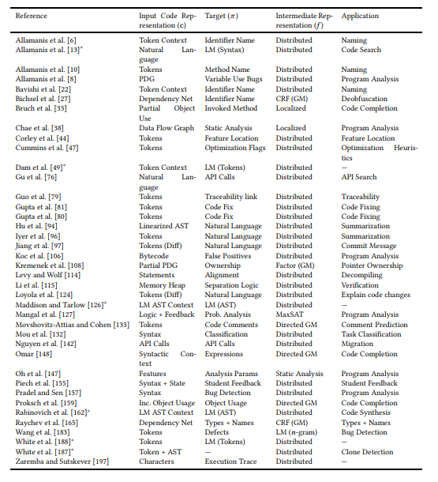

# Вводные слова


##  О лекторе


Если есть вопросы, то буду рад вам помочь с ними разобраться. 
Пишите:

- http://vk.me/theotheo
- http://t.me/ibelyalov

## О вас


## О лекции
Хотелось бы создать представление о том, чем занимается НЛП: о задачах, результатах, о возможностях и проблемах

Чтобы вы могли гордо сказать: "НЛП? Ну я что-то слышал..."


# Введение

## Проблема

Распознавание кликбейтов


## Кликбейт
    Кликбейт-заголовок (от clickbait — клик-приманка) — преднамеренно искаженный заголовок материала, зачастую низкого качества, основная задача которого — привлечение внимания пользователей социальной сети и провокация с целью перейти по ссылке.
https://netpeak.net/ru/blog/klikbyeit-zagolovki-vse-pochemu-lenta-facebook-stanet-luchshe/


## Дзен 
| Признак | Пример |
| --- |  --- |
| Утаивание информации, без которой невозможно понять содержание материала | Вы никогда не поверите, кто упал на красной дорожке... |
| Бессмысленные эмоционально окрашенные фразы | Свежая фотоподборка! Полный угар! Лежали всем офисом |
| Преувеличение или искажение фактов | Ученые выяснили: планете осталось недолго... |
| Обилие лишних заглавных букв и знаков препинания | Случай на пляже В СОЧИ!!! СМОТРЕТЬ всем! |
| Повелительное наклонение, обращение на «ты» | Ты не поверишь, что скрывает правительство! Жми ссылку, чтобы узнать! |
| Искажение текста: лишние пробелы или их отсутствие, орфографические ошибки | Новая ЗВЕЗДАЯ диета! Читай пока неудалили! |

https://yandex.ru/support/zen/requirements/clickbait.html 

## ВК

https://vk.com/@brown_room-click-click

## Facebook

    People tell us they don’t like stories that are misleading, sensational or spammy. That includes clickbait headlines that are designed to get attention and lure visitors into clicking on a link. In an effort to support an informed community, we’re always working to determine what stories might have clickbait headlines so we can show them less often.

https://newsroom.fb.com/news/2017/05/news-feed-fyi-new-updates-to-reduce-clickbait-headlines/

##


https://vk.com/weirdreparametrizationtrick?w=wall-131489096_4058

##  Корпус

      Abhijnan Chakraborty, Bhargavi Paranjape, Sourya Kakarla, and Niloy Ganguly. "Stop Clickbait: Detecting and Preventing Clickbaits in Online News Media”. In Proceedings of the 2016 IEEE/ACM International Conference on Advances in Social Networks Analysis and Mining (ASONAM), San Fransisco, US, August 2016.

https://github.com/bhargaviparanjape/clickbait


## Конвертация в dataframe

```python
from pathlib import Path
import pandas as pd

clickbait_text = Path('clickbait/dataset/clickbait_data').read_text()
non_clickbait_text = Path('clickbait/dataset/non_clickbait_data').read_text()
clickbait = pd.DataFrame([(line, 1) for line in clickbait_text.split('\n') if line], columns=['text', 'label'])
non_clickbait = pd.DataFrame([(line, 0) for line in non_clickbait_text.split('\n') if line], columns=['text', 'label'])

df = pd.concat([clickbait, non_clickbait])
df = df.reset_index(drop=True)

# df.to_csv('df.csv', index=False)
```

## Пример

```python
pd.options.display.max_colwidth = 0
df.sample(10)
```

## Dataframe

Грубо говоря табличный формат данных

## Структура данных

text -- заголовки

label -- 1, если кликбейт; 0, если не


## Итак

Есть примеры кликбейтов и есть примеры некликбейтов.

Как научить отличать их друг от друга?


# Решение в 1 строку. WOW!

## "Решаем"

```python
import random 

predict = [random.choice([0, 1]) for id, row in df.iterrows()] # вот она

predict[:10] # пример наших предсказаний
```

## Оценим результаты

## Метрики классификации

https://github.com/utd-ai/DMIA2018_Fall_public/blob/master/lecture05/L5_Validation.pdf


## Precision


## Recall


## F1
$F1 = 2\frac{precision \cdot recall}{precision + recall}$


## Матрица ошибок

```python
from sklearn.metrics import confusion_matrix
import seaborn as sns

cm = confusion_matrix(true, predict)
sns.heatmap(cm, annot=True, fmt='g')
```

```python
from sklearn.metrics import classification_report

print(classification_report(true, predict))
```

# 5 правил кликбейта

```python
import re 
CLICKBAIT_RULES = ['^What', '^Who', '^Which', '^When', '\d+']

RULE = '|'.join(CLICKBAIT_RULES) # просто объединяем регулярки в одну строку
```

## 


https://regex101.com/r/WwV5Rg/1


## Оценка

```python
predict = df['text'].str.match(RULE).astype(int)
cm = confusion_matrix(true, predict)

sns.heatmap(cm, annot=True, fmt='g')
```

```python
print(classification_report(true, predict))
```

# Машинное обучение


## Пример, который вы не забудете

http://www.r2d3.us/Наглядное-Введение-в-Теорию-Машинного-Обучения/

## 
::: columns

:::: column
X -- матрица фичей

y -- вектор лейблов
::::

:::: column
X = \[возвышение, год постройки, кол-во ванных, кол-во спален, стоимость, площадь, цена за m2\]

y = \[Сан-Франциско, Нью-Йорк\]
::::

:::


## для примера


## [task] Классификация текстов 


## Векторизация

```python
from sklearn.feature_extraction.text import CountVectorizer
from sklearn.model_selection import train_test_split


vectorizer = CountVectorizer()

y = df['label']
X = vectorizer.fit_transform(df['text'][:100])
```

```python
pd.DataFrame(X.A, columns=vectorizer.get_feature_names())
```

```python
occ = np.asarray(X.sum(axis=0)).ravel().tolist()
counts_df = pd.DataFrame({'term': vectorizer.get_feature_names(), 'occurrences': occ})
counts_df.sort_values(by='occurrences', ascending=False).head(20)
```


## Обучение

```python
from sklearn.linear_model import LogisticRegression
# from sklearn.linear_model import SGDClassifier

X = vectorizer.fit_transform(df['text'])
X_train,X_test, y_train, y_test = train_test_split(X, y)


clf = LogisticRegression()

clf.fit(X_train, y_train)
```

## Оценка

```python
predict = clf.predict(X_test)

cm = confusion_matrix(y_test, predict)
sns.heatmap(cm, annot=True, fmt='g')
```

```python
print(classification_report(y_test, predict))
```

## Интроспекция

```python
import eli5
eli5.show_weights(clf, top=(20, 20), vec=vectorizer)
```

```python
eli5.show_prediction(clf, df['text'][101], vec=vectorizer)
```

## Совсем новый текст

```python
eli5.show_prediction(clf, '1 things you should', vec=vectorizer)
```

# Нграммы


```python
from sklearn.linear_model import LogisticRegression
# from sklearn.linear_model import SGDClassifier

vectorizer = CountVectorizer(ngram_range=(1, 2))

y = df['label']
X = vectorizer.fit_transform(df['text'])
X_train, X_test, y_train, y_test = train_test_split(X, y)

clf = LogisticRegression()
clf.fit(X_train, y_train)
```

## Оценка

```python
predict = clf.predict(X_test)

cm = confusion_matrix(y_test, predict)
sns.heatmap(cm, annot=True, annot_kws={"size": 16}, fmt='g')
```

## Интроспекция

```python
import eli5
eli5.show_weights(clf, top=(20, 20), vec=vectorizer)
```

```python
# from sklearn.linear_model import LogisticRegression
# # from sklearn.linear_model import SGDClassifier

# vectorizer = CountVectorizer(ngram_range=(2, 2))

# y = df['label']
# X = vectorizer.fit_transform(df['text'])
# X_train, X_test, y_train, y_test = train_test_split(X, y)

# clf = LogisticRegression()
# clf.fit(X_train, y_train)
```

## Мешок слов

```python
bag_of_words = df['text'][30996].split()
print(bag_of_words)
```

```python
print(['FBI', 'not', 'confirms', 'that', 'ricin', 'was', 'found', 'at', 'the', 'University', 'of', 'Texas'])
```

```python
print(sorted(['FBI', 'not', 'confirms', 'that', 'ricin', 'was', 'found', 'at', 'the', 'University', 'of', 'Texas']))
```

## [task] Negation


https://aclanthology.info/catalog?q=negation&search_field=all_fields&sort=publish_date+desc%2C+venue_type+asc%2C+paper_anthology+asc%2C+score+asc&utf8=✓


## [task] Анализ тональности


Анализ тональности -- задача выявления эмоциональной окрашенности текста


# Языковая модель для генерации

Цель языкового моделирование -- оценить вероятностное распределения последовательности слов.


## Собираем слова вместе

```python

words = []
for title in df['text'].tolist():
    words.extend(title.split())

words[:10]
```

```python
import nltk

freqs = nltk.FreqDist(words) # словарь с частотами
freqs.most_common(20)
```

## Частоты пар / биграмм

```python
# an nltk.ConditionalFreqDist() counts frequencies of pairs.
# When given a list of bigrams, it maps each first word of a bigram
# to a FreqDist over the second words of the bigram.

cfreq_2gram = nltk.ConditionalFreqDist(nltk.bigrams(words))

cfreq_2gram.conditions()[:10]
```

```python
cfreq_2gram["I"]
```

```python
cfreq_2gram["I"].most_common(10)
```

## Вероятности биграмм

```python
# an nltk.ConditionalProbDist() maps pairs to probabilities.
# One way in which we can do this is by using Maximum Likelihood Estimation (MLE)

cprob_2gram = nltk.ConditionalProbDist(cfreq_2gram, nltk.MLEProbDist)

# Here is what we find for "my": a Maximum Likelihood Estimation-based probability distribution,
# as a MLEProbDist object.

cprob_2gram["I"] # Вероятность I
```

```python
# примеры слов что могут идти _после_ I
cprob_2gram["I"].samples() 


```

```python
# вероятности пары
cprob_2gram["I"].prob("can")
```

## Вероятность целого предложения

```python
freq_1gram = nltk.FreqDist(words)

len_words = len(words)

def unigram_prob(word):
    return freq_1gram[word] / len_words
```

```python
# P(how do you do) = P(how) * P(do|how) * P(you|do) * P(do | you)

prob_sentence = unigram_prob("how") * cprob_2gram["how"].prob("do") * cprob_2gram["do"].prob("you") * cprob_2gram["you"].prob("do")
prob_sentence
```

```python
text = "I lived in"
```

## Генерация текста

```python
cprob_2gram["I"].generate()
```

```python
word = "5"
sent = [word]
for index in range(10):
    word = cprob_2gram[ word].generate()
    sent.append(word)
    
' '.join(sent)
```

## Сгенерированные примеры


'What Was Better Project NASCAR driver Kyle Busch wins season Trade'

'What Is Real, Official UN releases 2005 wraps up German music'

'5 Ridiculously Adorable Animals 25 Times "Frasier" Was Grosser Than Reese\'s'


## [task] Spell Checker

## [task] Predictive Input

# Давай посмотрим на наши слова

## Частоты
```python
occ = np.asarray(X.sum(axis=0)).ravel().tolist()
counts_df = pd.DataFrame({'term': vectorizer.get_feature_names(), 'occurrences': occ})
counts_df.sort_values(by='occurrences', ascending=False).head(20)
```

## График топ 20

```python
counts_df.sort_values(by='occurrences', ascending=False).head(20).reset_index()['occurrences'].plot()
```

## Логарифмический график
```python
counts_df.sort_values(by='occurrences', ascending=False).reset_index()['occurrences'].plot(logy=True, logx=True)
```
## Все

```python

counts_df.sort_values(by='occurrences', ascending=False).reset_index()['occurrences'].plot()
```

## Закон Ципфа

    Закон Ципфа: График для частот слов из статей русской Википедии с рангами от 3 до 170
    Зако́н Ци́пфа («ранг—частота») — эмпирическая закономерность распределения частоты слов естественного языка: если все слова языка (или просто достаточно длинного текста) упорядочить по убыванию частоты их использования, то частота n-го слова в таком списке окажется приблизительно обратно пропорциональной его порядковому номеру n (так называемому рангу этого слова, см. шкала порядка). Например, второе по используемости слово встречается примерно в два раза реже, чем первое, третье — в три раза реже, чем первое, и так далее.


## [task] Частотные словари 

https://events.yandex.ru/lib/talks/3298/


# Сложность 2: разреженность
Какое бы количество текстов мы не взяли -- все равно мы не охватим все возможные варианты. 
То есть всегда будет найдется слово, которое мы не знаем. 
Что же делать? 


## Считаем по буквам

```python
from sklearn.linear_model import LogisticRegression

vectorizer = CountVectorizer(ngram_range=(1, 1), analyzer='char')

y = df['label']
X = vectorizer.fit_transform(df['text'])
```

## Матрица фичей
```python
pd.DataFrame(X.A, columns=vectorizer.get_feature_names())
```

## Обучение
```python
X_train, X_test, y_train, y_test = train_test_split(X, y)

clf = LogisticRegression()
clf.fit(X_train, y_train)
```

## Оценка
```python
predict = clf.predict(X_test)

cm = confusion_matrix(y_test, predict)
sns.heatmap(cm, annot=True, annot_kws={"size": 16}, fmt='g')
```

## Интроспекция
```python
eli5.show_weights(clf, top=(20, 20), vec=vectorizer)
```

# В 1000 раз уменьшить пространство поможет...

```python
from sklearn.linear_model import LogisticRegression

vectorizer = CountVectorizer(ngram_range=(1, 1), analyzer='char')

y = df['label']
X = vectorizer.fit_transform(df['text'])

from sklearn.decomposition import TruncatedSVD
reduction = TruncatedSVD(n_components=20, algorithm='randomized', n_iter=10, random_state=1)

X = reduction.fit_transform(X)
```

```python
reduction.explained_variance_ratio_
```

## Матрица фичей

N-мерная, плотная (dense) 
```python
pd.DataFrame(X)
```

## Обучение
```python
X_train, X_test, y_train, y_test = train_test_split(X, y)

clf = LogisticRegression()
clf.fit(X_train, y_train)
```

## Оценка
```python
predict = clf.predict(X_test)

cm = confusion_matrix(y_test, predict)
sns.heatmap(cm, annot=True, fmt='g')
```

## [task] Latent semantic analysis (LSA)

[](https://upload.wikimedia.org/wikipedia/commons/7/70/Topic_model_scheme.webm)


# Как сделать свой Google
кстати про поиск


## Векторизуем наши документы

```python
from sklearn.feature_extraction.text import CountVectorizer

vectorizer = CountVectorizer()
matrix = vectorizer.fit_transform(df['text'])
matrix
```

## Векторизуем запрос

```python
query = vectorizer.transform(['10 greatest things'])
query
```

## Считаем косинусное расстояние


```python
from sklearn.metrics.pairwise import linear_kernel

cosine_similarities = linear_kernel(query, X).flatten()
cosine_similarities
```

## Отбираем ближайшие документы

```python
related_docs_indices = cosine_similarities.argsort()[:-5:-1]
related_docs_indices
df[df.index.isin(related_docs_indices)]
```

## [task] Information Retrieval (IR)


# Всего 2 размерности дадут вам...

```python
from sklearn.linear_model import LogisticRegression

vectorizer = CountVectorizer(ngram_range=(1, 1), analyzer='char')

y = df['label']
X = vectorizer.fit_transform(df['text'])

from sklearn.decomposition import TruncatedSVD
reduction = TruncatedSVD(n_components=2, algorithm='randomized', n_iter=10, random_state=1)

X = reduction.fit_transform(X)
```

## Матрица фичей

```python
pd.DataFrame(X)
```

## Визуализация

```python
import matplotlib.pyplot as plt 

label1 = df[df['label'] == 1].index
plt.scatter(X[label1, 0], X[label1, 1], c='red')

label0 = df[df['label'] == 0].index
plt.scatter(X[label0, 0], X[label0, 1], c='blue')
```

## [task] Text visualization

http://textvis.lnu.se


# Разложим слова
(на базе https://github.com/madrugado/word2vec-article/blob/master/svd-example-2.ipynb)


## построим матрицу слово-слово

```python
import nltk 

dic = {}
for sent in df['text'].tolist()[:1000]: # не все тексты, а только часть для простоты
    words = nltk.word_tokenize(sent.lower())
    for w in words:
        if w not in dic:
            dic[w] = {}
        for w2 in words:
            dic[w][w2]=1
```

```python

words_df = pd.DataFrame(dic).fillna(0)
words_df
```

## Снова сведем к 2 размерностям

```python
from sklearn.decomposition import PCA

pca = PCA()

res = pca.fit_transform(words_df)
```

```python
plt.figure(figsize=(14, 14))
# plt.scatter(res[:,0], res[:,1])
for i, label in enumerate(words_df.columns[:300]):
    x, y = res[i,0], res[i,1]
    _ = plt.scatter(x, y);
    _ = plt.annotate(label, xy=(x, y),  textcoords='offset points',
                   ha='right', va='bottom', );
```

## [task] Word embeddings


# Граммы, которые изменили мир
Skip-gram и word2vec 


## Конвертируем в список списков слов

```python
import nltk

sents = [nltk.word_tokenize(text) for text in df['text'].str.lower().tolist()]
sents[:5]
```

## Обучаем word2vec

```python
import gensim
import logging
logging.basicConfig(format='%(asctime)s : %(levelname)s : %(message)s', level=logging.INFO)

model = gensim.models.Word2Vec(
    sents, size=150, window=10, min_count=2, workers=10)

model.train(sents, total_examples=len(sents), epochs=10)
```

## Каждое слово -- вектор

```python
model.wv['what'] # 150-мерный
```

## Похожие слова

```python
model.wv.most_similar('what')
```

```python
model.wv.most_similar('obama')
```

```python
model.wv.most_similar('love')
```

## Близость слов

```python

```

```python
model.wv.distance('love', 'hate')
```

```python
model.wv.distance('love', 'friend')
```

```python


vocab = list(model.wv.vocab)
X = model[vocab]

from sklearn.decomposition import PCA

pca = PCA(2)

res = pca.fit_transform(X)

w2v_df = pd.DataFrame(res, index=vocab, columns=['x', 'y'])

```

```python
# fig = plt.figure()
fig = plt.figure(figsize=(14, 14))
ax = fig.add_subplot(1, 1, 1)

ax.scatter(w2v_df['x'], w2v_df['y'])

for word, pos in w2v_df.iterrows():
    _ = ax.annotate(word, pos);
```

# PyTorch
```python
! pip install --upgrade git+https://github.com/pytorch/text
```

```python
import pandas as pd
import numpy as np
import torch
```

```python
from torchtext.data import Field
tokenize = lambda x: x.split()
TEXT = Field(sequential=True, tokenize=tokenize, lower=True)
 
LABEL = Field(sequential=False, use_vocab=False)
```

```python
VAL_RATIO = 0.2
def prepare_csv(seed=1):
    df_train = pd.read_csv("df.csv")
    idx = np.arange(df_train.shape[0])
    np.random.seed(seed)
    np.random.shuffle(idx)
    val_size = int(len(idx) * VAL_RATIO)
    df_train.iloc[idx[val_size:], :].to_csv("df_train.csv", index=False)
    df_train.iloc[idx[:val_size], :].to_csv("df_val.csv", index=False)
```

```python
prepare_csv()
```

```python
from torchtext.data import TabularDataset
 
tv_datafields = [
                 ("text", TEXT), # we won't be needing the id, so we pass in None as the field
                 ("label", LABEL),
                 ]
trn, vld = TabularDataset.splits(
               path="./", # the root directory where the data lies
               train='df_train.csv', validation="df_val.csv",
               format='csv',
               skip_header=True, # if your csv header has a header, make sure to pass this to ensure it doesn't get proceesed as data!
               fields=tv_datafields)

```

```python
trn.head
```

```python
trn[0]
```

```python
trn[0].__dict__.keys()
```

```python
trn[0].text[:3]
```

```python
TEXT.build_vocab(trn)
```

```python
from torchtext.data import Iterator, BucketIterator
 
train_iter, val_iter = BucketIterator.splits(
 (trn, vld), # we pass in the datasets we want the iterator to draw data from
 batch_sizes=(64, 64),
 device=-1, # if you want to use the GPU, specify the GPU number here
 sort_key=lambda x: len(x.text), # the BucketIterator needs to be told what function it should use to group the data.
 sort_within_batch=False,
 repeat=False # we pass repeat=False because we want to wrap this Iterator layer.
)
```

```python
class BatchWrapper:
    def __init__(self, dl, x_var, y_vars):
        self.dl, self.x_var, self.y_vars = dl, x_var, y_vars # we pass in the list of attributes for x and y
    
    def __iter__(self):
        for batch in self.dl:
            x = getattr(batch, self.x_var) # we assume only one input in this wrapper
            
            if self.y_vars is not None: # we will concatenate y into a single tensor
                y = torch.cat([getattr(batch, feat).unsqueeze(1) for feat in self.y_vars], dim=1).float()
            else:
                y = torch.zeros((1))

            yield (x, y)
    
    def __len__(self):
        return len(self.dl)
 
```

```python
train_dl = BatchWrapper(train_iter, "text", ["label"])
valid_dl = BatchWrapper(val_iter, "text", ["label"])

```

```python
next(train_dl.__iter__())
```

```python

```

```python
from torch import nn

class SimpleBiLSTMBaseline(nn.Module):
    def __init__(self, hidden_dim, emb_dim=300,
                 spatial_dropout=0.05, recurrent_dropout=0.1, num_linear=1):
        super().__init__() # don't forget to call this!
        self.embedding = nn.Embedding(len(TEXT.vocab), emb_dim)
        self.encoder = nn.LSTM(emb_dim, hidden_dim, num_layers=1, dropout=recurrent_dropout)
        self.linear_layers = []
        for _ in range(num_linear - 1):
            self.linear_layers.append(nn.Linear(hidden_dim, hidden_dim))
        self.linear_layers = nn.ModuleList(self.linear_layers)
        self.predictor = nn.Linear(hidden_dim, 1)
    
    def forward(self, seq):
        hdn, _ = self.encoder(self.embedding(seq))
        feature = hdn[-1, :, :]
        for layer in self.linear_layers:
            feature = layer(feature)
        preds = self.predictor(feature)
        return preds
```

```python

em_sz = 100
nh = 500
nl = 3
model = SimpleBiLSTMBaseline(nh, emb_dim=em_sz); model
```

```python
import tqdm
```

```python
opt = torch.optim.Adam(model.parameters(), lr=1e-2)
loss_func = nn.BCEWithLogitsLoss()
```

```python
epochs = 2
```

```python
%%time
for epoch in range(1, epochs + 1):
    running_loss = 0.0
    running_corrects = 0
    model.train() # turn on training mode
    for x, y in tqdm.tqdm(train_dl): # thanks to our wrapper, we can intuitively iterate over our data!
        opt.zero_grad()

        preds = model(x)
        loss = loss_func(preds, y)
        loss.backward()
        opt.step()
        
        running_loss += loss.item() * x.size(0)
        
    epoch_loss = running_loss / len(trn)
    
    # calculate the validation loss for this epoch
    val_loss = 0.0
    model.eval() # turn on evaluation mode
    for x, y in valid_dl:
        preds = model(x)
        loss = loss_func(preds, y)
        val_loss += loss.item() * x.size(0)

    val_loss /= len(vld)
    print('Epoch: {}, Training Loss: {:.4f}, Validation Loss: {:.4f}'.format(epoch, epoch_loss, val_loss))
```

# Программисты в ужасе от того, что может генерация кода 
Применение методов NLP к задачам обработки языков программирования. 

## [Machine Learning for Big Code and Naturalness](https://ml4code.github.io/papers.html)


https://arxiv.org/abs/1709.06182

## [JetBrains Research](https://research.jetbrains.org/ru/groups/ml_methods)

# ШОК! Количество задач опять выросло

https://nlpprogress.com

# Резюме


## Очень много чего интересного еще

- multi-task joint learning
- reinforcement learning
- корпусную лингвистику
- мультиязыковые модели
- диалоговые системы
- ...

## 3 причины почему сложно:

- неоднозначен
- разрежен 
- потенциально бесконечная вложенность

## 3 подхода к методам:

- rule-based
- статистический
- нейросетевой

## Знайте Python

## Знайте классные тулзы

## sklearn


https://scikit-learn.org/stable/

## NLTK


https://www.nltk.org/book/

## gensim


https://rare-technologies.com/

## pytorch

https://github.com/hunkim/PyTorchZeroToAll

## AllenNLP

https://demo.allennlp.org/machine-comprehension

## Читайте

## ACL Anthology


 https://aclanthology.info

## Диалог


## Arxiv
https://arxiv.org


https://vk.com/arxivfeed

## Semantic Scholar

https://www.semanticscholar.org/


## Awesome NLP

https://github.com/keon/awesome-nlp

# Летняя школа по NLP

